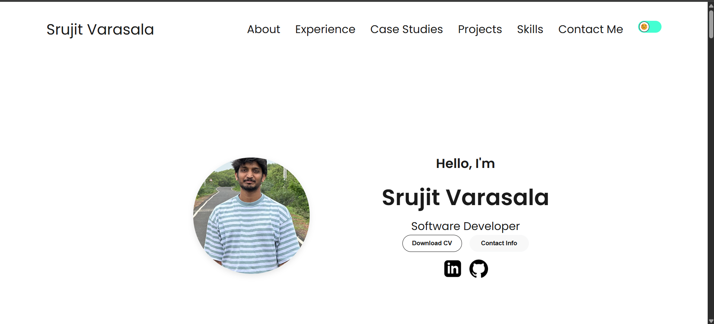
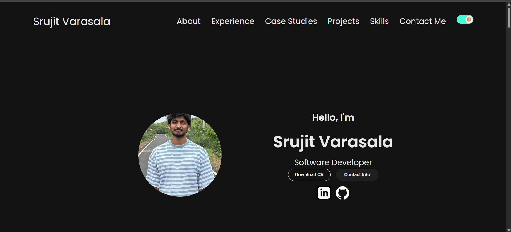
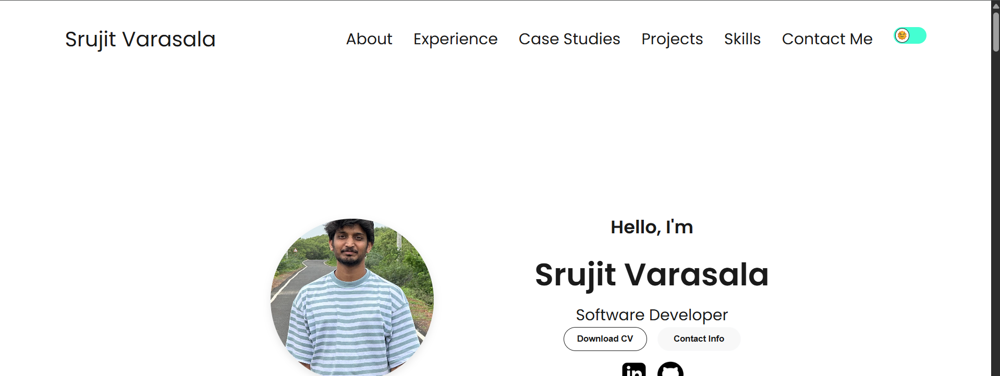

# 🌐 Srujit Varasala – Personal Portfolio Website

This is my personal portfolio website built using HTML, CSS, and JavaScript to showcase my projects, experience, skills, and published research paper. It includes a responsive design, dark/light mode toggle, animations, and mobile-first layout.

## ✨ Features

- 🌙 Light/Dark mode toggle with emoji icon + toast notification
- 📱 Fully responsive for mobile, tablet, and desktop
- 🎯 Smooth animations and transitions
- 🧠 Accordion-style skills section
- 🎓 Dedicated "Publications" section with linked research paper
- 📄 Resume download and PDF viewer support
- 💾 Theme preference saved via `localStorage`

## 🛠 Tech Stack

- HTML5
- CSS3 + Media Queries
- JavaScript (ES6+)
- Intersection Observer API
- LocalStorage API

## 📁 Folder Structure

Portfolio/
│
├── assets/ # Image assets
├── index.html # Main HTML file
├── style.css # Main styles
├── mediaqueries.css # Responsive breakpoints
├── script.js # Core JS logic
├── README.md # Project overview
├── Srujit_Resume.pdf # Downloadable resume
├── JETIR1811003.pdf # Published research paper


## 🚀 Getting Started

To run this project locally:

```bash
# Clone the repository
git clone https://github.com/srujit12091997/Portfolio.git
cd Portfolio

# Then simply open in browser
open index.html   # or manually double-click

## 📝 Publication Highlight

**📄 “Arduino Based System to Monitor the Plants' Health and Growth Using Wireless Sensors”**  
Co-authored and published in the *Journal of Emerging Technologies and Innovative Research (JETIR)*, November 2018.  
🔗 [View Full Paper](https://www.jetir.org/papers/JETIR1811003.pdf)

📸 Preview
<<<<<<< HEAD
Light Mode


Dark Mode

=======
Dark Mode


Light Mode

>>>>>>> 88e8843 (adding profile picture)

👨‍💻 Author
Srujit Varasala
## 📬 Contact

- 📧 Email: [Srujit.v@gmail.com](mailto:Srujit.v@gmail.com)  
- 💼 LinkedIn: [linkedin.com/in/srujitvarasala](https://www.linkedin.com/in/srujitvarasala/)  
- 🛠 GitHub: [github.com/srujit12091997](https://github.com/srujit12091997)

Built with ❤️ and HTML/CSS/JS

Thank You!